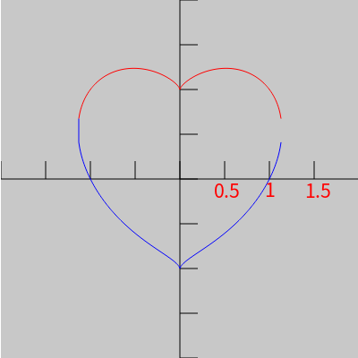

### 1. 绘制爱心

使用js的canvas 2D绘图

javascript canvas 绘图:
https://developer.mozilla.org/zh-CN/docs/Web/API/Canvas_API/Tutorial/Drawing_shapes

公式参考链接:
http://www.360doc.cn/mip/680393802.html
https://wk.baidu.com/view/6296ddd1b14e852458fb574f

在线预览:

来自动漫 [ 理科生坠入情网，故尝试证明。](https://www.bilibili.com/bangumi/media/md28223860/?from=search&amp;seid=5157940974020117719 )最后一集出现的公式

根据公式画出轨迹

公式:
$$
(x^2 + y^2-1)^3=x^2y^3
$$
知x时y的解(网上的图片)

解的公式

在直角坐标系中绘制时,x取值范围在 [-1.x,1.x]之间,上面解的公式中+时，绘制的是上面的部分，为-时绘制下面的部分

使用javascript canvas绘制时，有下面这些要注意的

- 原点在屏幕左上角,向左x增加,向下y增加。和直角坐标系的第四象限差不多，但是直角坐标系的是y减少的。所以用上面公式绘制时y坐标需要变成相反数

- 公式的解对应的取值范围，换成屏幕的像素时，一般都是几百的，这里是用公式计算完，再乘倍数放大。最后将图像x,y都加指定值，移动到屏幕中心.

  